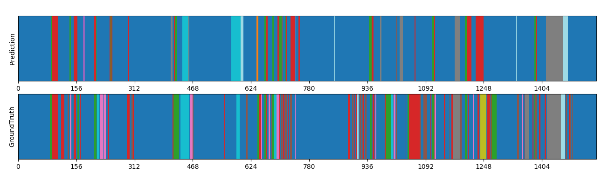

# Video action recognition and temporal action segmentation

This project to perform both trimmed action recognition and temporal action segmentation in full-length videos.
The first part creates a model that recognizes actions in trimmed videos, while the second part uses this model and expands it to recognize different actions in a long video.
Model can be trained with other videos and actions to recognze them. Contact me for more information on how to run new model if you can't understand it through the code.
This was done for the subject DLCV of NTU and further expanded for personal use.

### Example of video action segmentation compared to ground truth

### Dataset
We have provided a shell script for downloading and extracting the dataset for this assignment. For Linux users, simply use the following command.

    bash ./get_dataset.sh
	
The shell script will automatically download the dataset and store the data in a folder called `hw4_data`. Note that this command by default only works on Linux. If you are using other operating systems, you should download the dataset from [this link](https://drive.google.com/uc?export=download&id=1ncmqWLctmvecIXBdVng5cvbROoTWFSpE) and unzip the compressed file manually.

For this dataset, the action labels are defined as below:

|       Action      | Label |
|:-----------------:|:-----:|
| Other             | 0     |
| Inspect/Read      | 1     |
| Open              | 2     |
| Take              | 3     |
| Cut               | 4     |
| Put               | 5     |
| Close             | 6     |
| Move Around       | 7     |
| Divide/Pull Apart | 8     |
| Pour              | 9     |
| Transfer          | 10    |

We will run your code in the following manner:

**Problem 1**

    bash ./hw4_p1.sh $1 $2 $3
-   `$1` is the folder containing the ***trimmed*** validation videos (e.g. `TrimmedVideos/video/valid/`).
-   `$2` is the path to the ground truth label file for the videos (e.g. `TrimmedVideos/label/gt_valid.csv`).
-   `$3` is the folder which outputs your predicted labels (e.g. `./output/`)

**Problem 2**

    bash ./hw4_p2.sh $1 $2 $3
-   `$1` is the folder containing the ***trimmed*** validation/test videos.
-   `$2` is the path to the ground truth label file for the videos (e.g. `TrimmedVideos/label/gt_valid.csv` or `TrimmedVideos/label/gt_test.csv`).
-   `$3` is the folder which outputs your predicted labels (e.g. `./output/`).

**Problem 3**

    bash ./hw4_p3.sh $1 $2
-   `$1` is the folder containing the ***full-length*** validation videos.
-   `$2` is the folder which outputs your predicted labels (e.g. `./output/`).

### Packages
This projetct is done using python3.6 and you can use all the python3.6 standard libraries. For a list of third-party packages allowed to be used in this assignment, please refer to the requirments.txt for more details.
You can run the following command to install all the packages listed in the requirements.txt:

    pip3 install -r requirements.txt

Note that using packages with different versions will very likely lead to compatibility issues, so make sure that you install the correct version if one is specified above. E-mail or ask the TAs first if you want to import other packages.